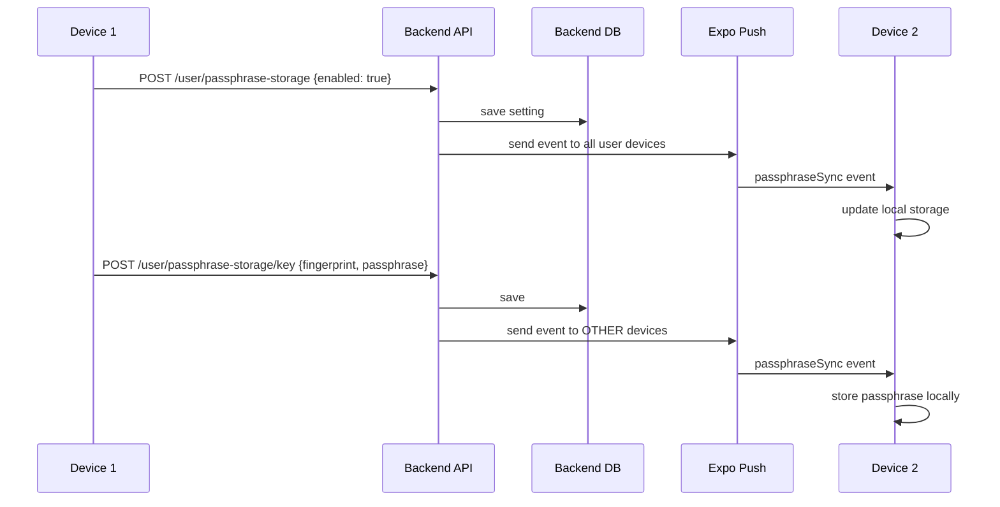

# Passphrase Storage Sync Across Devices

**Scope:** Backend (Purrivacy server) + Client (PurrivacyApp)
**Date:** 2026-06-13

## Current State

### Client (PurrivacyApp)
- [`passphraseStore.ts`](src/features/security/services/passphraseStore.ts) stores passphrases locally in SecureStore/SQLite
- `setPassphraseStorageEnabled()` saves setting locally and emits local-only event
- `storePassphrase()` writes to local SecureStore only
- No server communication for passphrase changes
- Key mutation service already has `privateKeyPassphrase` field in encrypted key records
- `storeSyncedPassphrase()` and `forgetStoredPassphrases()` functions exist but only update DB

### Backend (Purrivacy)
- `NotificationService.sendDataOnlyNotification()` exists for FCM events
- `/user/save-push-token` and `/user/delete-push-token` endpoints
- Session revocation already uses `sendDataOnlyNotification`
- **No existing passphrase storage sync infrastructure**

### What's Missing
1. No way to sync passphrase storage setting across devices via backend
2. No FCM events for passphrase changes
3. When user disables storage, passphrases are only cleared locally
4. When user changes a passphrase, other devices don't know about it

## Architecture



## Implementation Plan

### Phase 1: Backend (Purrivacy) — 3 API endpoints

**1.1 Set Passphrase Storage Enabled**
```
POST /user/passphrase-storage
Authenticated
Body: { enabled: boolean }
```
- Save setting in user record
- If `enabled: false`: clear all stored passphrases for this user from DB
- Send FCM `passphraseStorageChanged` event to all user's devices (including initiator)
- Event payload: `{ eventName: 'passphraseStorageChanged', payload: { enabled: true/false } }`

**1.2 Sync Passphrase**
```
POST /user/passphrase-storage/key
Authenticated
Body: { fingerprint: string, passphrase: string }
```
- Validate passphrase length
- Save to user record
- Send FCM `passphraseSynced` event to other user devices (exclude initiator via sourcePushToken)
- Event payload: `{ eventName: 'passphraseSynced', payload: { fingerprint, passphrase } }`

**1.3 Delete Passphrase**
```
POST /user/passphrase-storage/key/delete
Authenticated
Body: { fingerprint: string }
```
- Remove from user record
- Send FCM `passphraseDeleted` event to other user devices

**New notification event types registered:**
- `passphraseStorageChanged` — storage enabled/disabled toggle
- `passphraseSynced` — individual passphrase added/changed
- `passphraseDeleted` — individual passphrase removed

### Phase 2: Client (PurrivacyApp) — 3 changes

**2.1 Backend API Integration**

Modify `setPassphraseStorageEnabled()` in `passphraseStore.ts`:
- Call `POST /user/passphrase-storage` after local save
- When disabling: backend clears all passphrases from DB and notifies devices

Modify `storePassphrase()` in `passphraseStore.ts`:
- Call `POST /user/passphrase-storage/key` with fingerprint + passphrase
- Backend persists and notifies other devices

Modify `clearPassphrase()` in `passphraseStore.ts`:
- Call `POST /user/passphrase-storage/key/delete` with fingerprint
- Backend notifies other devices

**2.2 Receive FCM Events**

Add new event types to `eventService.ts` event name set:
```ts
'passphraseStorageChanged',
'passphraseSynced',
'passphraseDeleted',
```

Add handler in `useNotificationService.ts` (or dedicated hook) to:
- `passphraseStorageChanged` → update local `setPassphraseStorageEnabled()` without re-triggering API call
- `passphraseSynced` → call `storePassphrase()` locally (skip API call to avoid loop)
- `passphraseDeleted` → call `clearPassphrase()` locally (skip API call to avoid loop)

**2.3 Prevent Notification Loops**

Use a local flag (`isRemoteSync`) when processing FCM events to prevent re-triggering the same API calls:
- Local user action → save locally → call API → API notifies other devices
- Remote FCM event → save locally → do NOT call API (only update local state)

### Phase 3: Change Passphrase Sync

**3.1 When User Changes a Key Passphrase**

Modify key mutation service operations:
- `changePassphrase()` already has `privateKeyPassphrase` field
- After updating key record, also call `storePassphrase()` to sync new passphrase to backend
- `changeExpiration()` similarly syncs passphrase if stored

### Implementation Order

| Step | Location | Description | Effort |
|------|----------|-------------|--------|
| 1 | Backend routes | Add 3 new endpoints | Medium |
| 2 | Backend notification | Register new event types | Small |
| 3 | Client event service | Add new event types | Small |
| 4 | Client passphrase store | API calls for storage toggle and passphrase sync | Medium |
| 5 | Client notification handler | Handle incoming FCM events | Medium |
| 6 | Client key mutations | Sync passphrase on change | Small |
| 7 | Tests | API + unit tests | Medium |

### Files Changed

**Backend (Purrivacy):**
- `src/features/user/api/userRoutes.ts` — new endpoints
- `src/features/user/application/userWrites.ts` — passphrase storage logic
- `src/features/notification/application/notificationOptions.ts` — new event types (optional, only if validation needed)

**Client (PurrivacyApp):**
- `src/services/eventService.ts` — new event types
- `src/features/security/services/passphraseStore.ts` — API calls
- `src/hooks/useNotificationService.ts` — FCM event handler
- `src/api/user/userApi.ts` — API client functions
- `src/features/keys/services/keyMutationService.ts` — sync passphrase on key operations

---

## Issue 2: KeyList PGP Key Scroll Regression

### Investigation
The [`KeyMaterialBlock`](src/features/keys/components/KeyMaterialBlock.tsx) already has `ScrollView` with `nestedScrollEnabled={true}` and `maxHeight: 260`. Our branch made zero `.tsx` changes, so the regression is pre-existing on main or from a different change.

### Possible Causes
1. Parent `KeyboardAwareScroll` consuming nested scroll events
2. `maxHeight: 260` + `overflow: 'hidden'` preventing scroll gesture detection
3. `TouchableOpacity` wrapper inside ScrollView capturing touch events

### Fix Candidate
The same fix likely applies to `PrivateKeyRevealPanel` which also displays PGP key text.

**Check:** Compare these files against the last known working commit to find what changed.

### Files to Investigate
- `src/features/keys/components/KeyMaterialBlock.tsx` — public key display
- `src/features/keys/components/PrivateKeyRevealPanel.tsx` — private key display
- `src/components/KeyboardAwareScroll.ts` — parent scroll container
